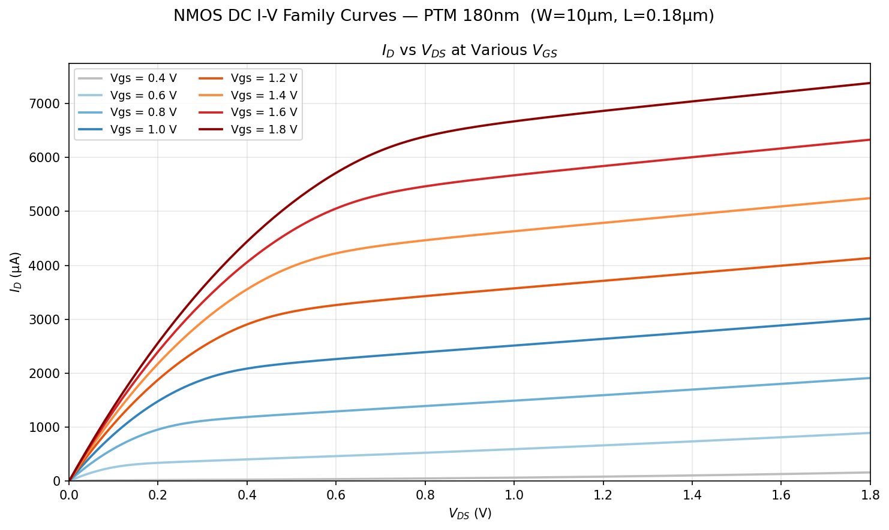
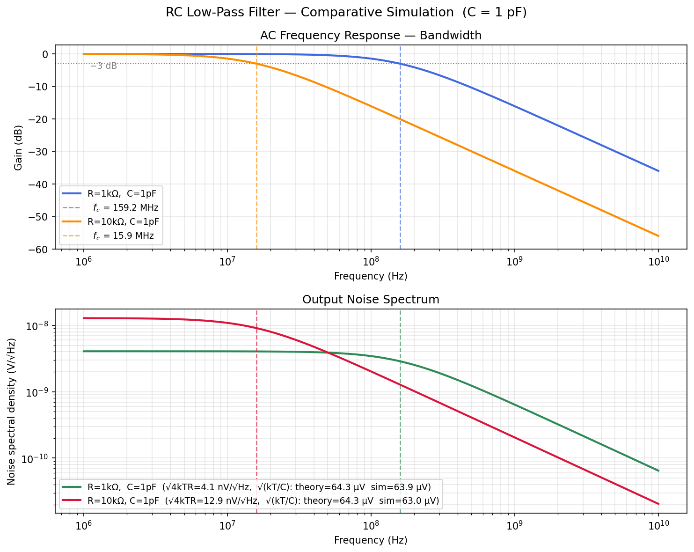
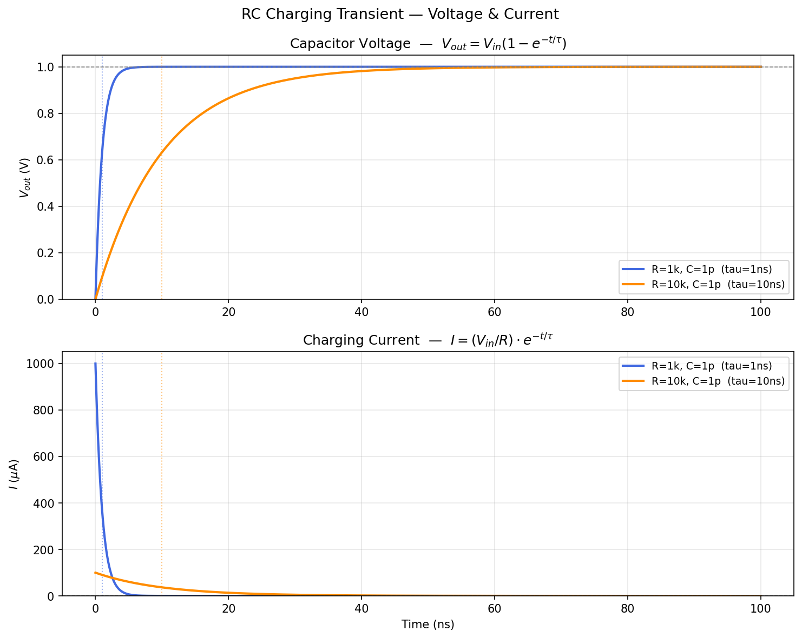
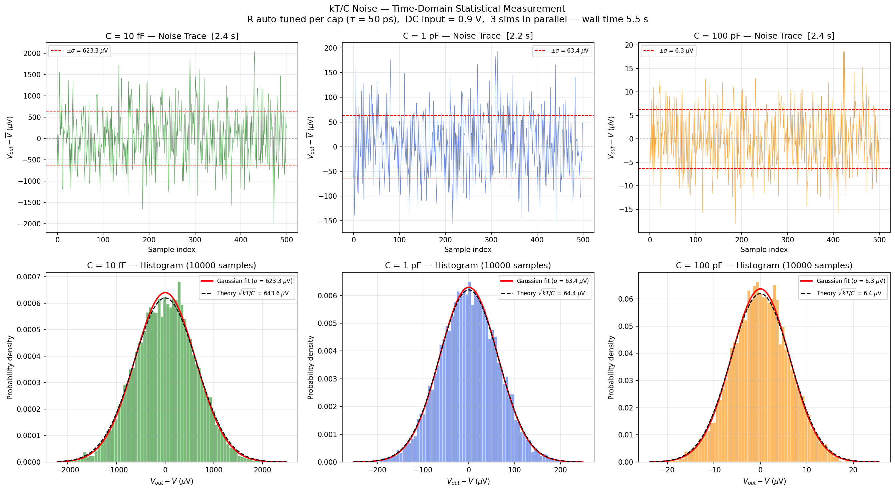
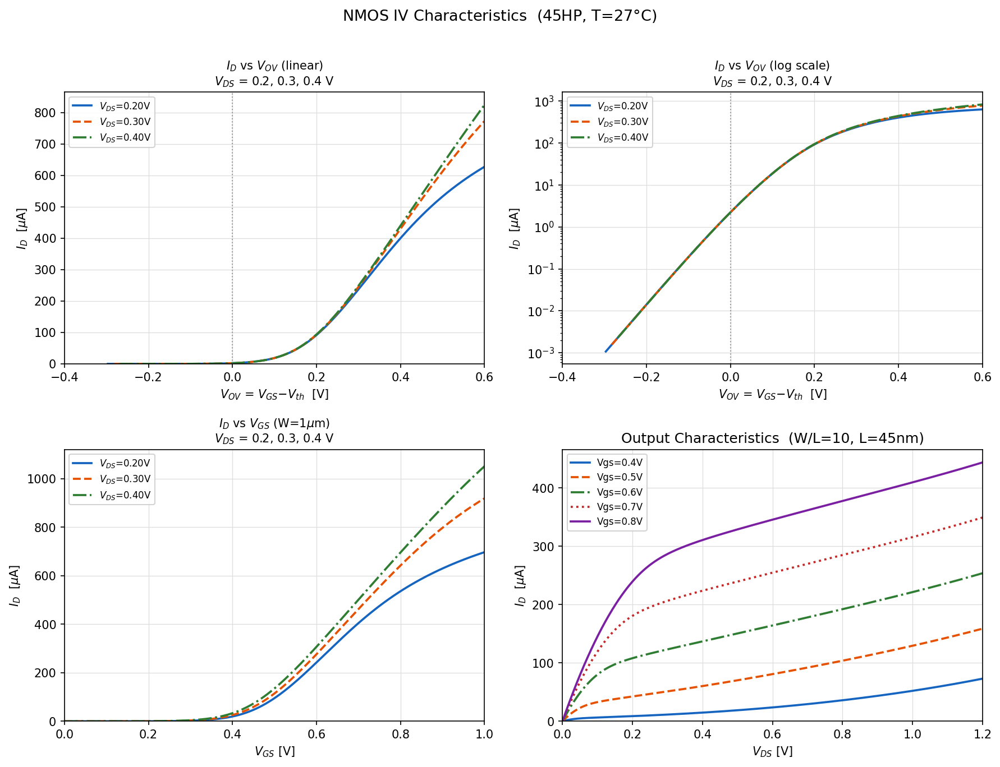
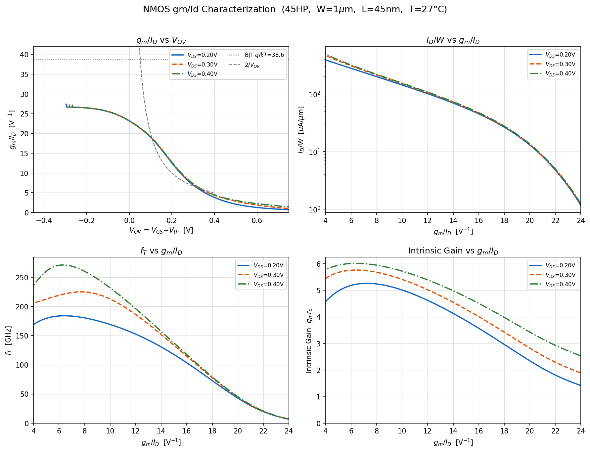
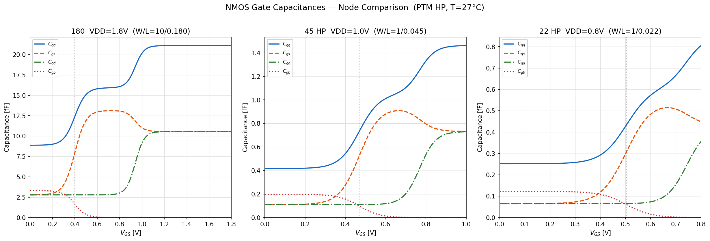

<p align="center">
  
</p>

<h1 align="center">gmoverid-skill</h1>

<p align="center">
  <a href="https://github.com/Arcadia-1/gmoverid-skill/stargazers"></a>
  <a href="https://github.com/Arcadia-1/gmoverid-skill/network/members"></a>
  <a href="https://github.com/Arcadia-1/gmoverid-skill/issues"></a>
  <a href="https://github.com/Arcadia-1/gmoverid-skill/commits/main"></a>
</p>

<p align="center">
  <a href="https://www.python.org/downloads/"></a>
  
  <a href="https://github.com/Arcadia-1/gmoverid-skill/pulls"></a>
  
</p>

Three skill packages that give an Agent the ability to design and simulate analog circuits: **ngspice basics** / **gm/ID design** / **PTM model library**.

> **If you are human**: the examples below include images that show each skill's output at a glance.

> **If you are an AI Agent**: skip the images and go directly to [Installation](#installation). The full instructions for each skill are in its own `SKILL.md`; runnable scripts and model files are in the `assets/` directories.

## Skill Overview

| Skill | Positioning | Features |
|------|------|------|
| **ngspice** | Beginner | 9 standard simulation examples (DC / AC / Tran / Noise) for learning SPICE from scratch |
| **gmoverid** | Advanced | gm/ID characterization simulation + design API, with automatic lookup of W, Id, Vgs, fT, and gm*ro |
| **transistor-models** | Model library | Full PTM model files (bulk silicon 65-180nm, HP/LP 22-45nm, FinFET 7-20nm) |

---

## Skill 1: ngspice

9 simulation examples covering the core concepts of introductory analog circuits:

| # | Type | Description | Output |
|---|------|------|------|
| 1 | Tran | RC charging voltage and current | `tran_rc_charging.png` |
| 2 | DC | NMOS Id-Vds family of curves | `dc_nmos_iv.png` |
| 3 | AC | RC low-pass filter frequency response | `ac_rc_bw.png` |
| 4 | Noise | RC filter output noise spectral density | `ac_rc_bw.png` |
| 5 | Tran | Sample-and-hold switch comparison | `sample_hold_compare.png` |
| 6 | Tran | kT/C noise time-domain statistics | `tran_ktc_noise_hist.png` |
| 7 | DC | NMOS current mirror output characteristics | `dc_current_mirror.png` |
| 8 | AC | Common-source amplifier Bode plot | `ac_cs_amp_bode.png` |
| 9 | DC | Transmission-gate on-resistance | `dc_tgate_ron.png` |

See [`ngspice/SKILL.md`](./ngspice/SKILL.md) for usage. The Agent will automatically deploy the assets and run the examples.

**NMOS Id-Vds Family of Curves**



**RC Low-Pass Filter Frequency Response**



**RC Charging Voltage and Current**



**kT/C Noise Time-Domain Statistics**



---

## Skill 2: gmoverid

Each process node generates three sets of standard plots:

**IV Characteristic Plot** (2x2)
- Id vs Vov in linear scale: clearly shows the threshold and saturation current
- Id vs Vov in log scale: subthreshold slope and an approximately 7-decade dynamic range
- Id vs Vgs (full sweep from 0 to VDD)
- Output characteristics, Id vs Vds (multiple curves at fixed Vgs values)



**gm/ID Four-Quadrant Characteristic Plot** (2x2)
- **gm/ID vs Vov**: full weak-inversion to strong-inversion behavior, including the BJT limit q/kT = 38.6 V^-1 and the 2/Vov asymptote reference
- **Id/W vs gm/ID** (log Y-axis): current density as the bias point changes, spanning approximately 3 decades
- **fT vs gm/ID**: cutoff frequency; PTM 180nm peaks at about 50 GHz, while PTM 22nm HP exceeds 600 GHz
- **gm*ro vs gm/ID**: intrinsic gain distribution versus bias point; 180nm reaches about 40-42 in weak inversion (gm/ID ~= 20), while 22nm HP is only 2-4 because of significant short-channel effects



**Gate Capacitance Plot**
- Cgg / Cgs / Cgd / Cgb vs Vgs: shows capacitance distribution and transitions from cutoff to threshold to strong inversion

**Comparison Plots**
- Channel-length comparison (L = 180 / 360 / 1000 nm): longer channels significantly improve gm*ro (up to ~140), with a corresponding reduction in fT
- Cross-node comparison (180nm SVT vs 22nm HP): clearly shows the speed-gain tradeoff across technology generations



**Design API**: given a gm/ID target, automatically looks up W, Id, Vgs, gm, fT, and gm*ro

```python
from design_gmoverid import GmIdTable, print_op

tbl = GmIdTable('nmos180', W=10.0, L=0.18, vds=0.9)

op = tbl.size(gmid=15.0, Id=100e-6)   # Fixed gm/ID and drain current; solve for W
op = tbl.size_from_ft(5e9, W=20.0)    # fT >= 5 GHz; choose the lowest-power operating point
print_op(op)
```

The first call automatically runs the ngspice simulation and caches the result. Later calls read directly from the cache.

The package includes three built-in PTM models: **180 / 45 / 22 nm**. Once installed, it is ready for simulation. If you need more process nodes, install the `transistor-models` skill.

---

## Skill 3: transistor-models

PTM (Predictive Technology Model) is a public SPICE model set maintained by Arizona State University (ASU), intended for process exploration and teaching or research when no PDK is available. This skill packages all models from [mec.umn.edu/ptm](https://mec.umn.edu/ptm):

- Traditional bulk silicon: 180 / 130 / 90 / 65 nm
- Bulk silicon HP/LP: 45 / 32 / 22 nm
- PTM-MG FinFET (multi-gate): 20 / 16 / 14 / 10 / 7 nm, HP + LSTP

It is independent of `gmoverid`. `gmoverid` already includes commonly used nodes; install this skill only when you need additional nodes such as 32nm LP or 7nm FinFET.

Copy the required `.lib` files from `transistor-models/assets/models/` into your project's `models/` directory as needed:

```bash
cp transistor-models/assets/models/bulk_cmos/ptm32lp.lib <project-dir>/models/
cp transistor-models/assets/models/finfet/nmos7mg_hp.lib <project-dir>/models/
```

File naming rules:
- `bulk_cmos/ptm{node}{hp|lp}.lib` - bulk silicon HP/LP, including NMOS + PMOS (model names: `nmos` / `pmos`)
- `bulk_cmos/ptm{node}.lib` - traditional bulk silicon, including NMOS + PMOS
- `finfet/{n|p}mos{node}mg_{hp|lstp}.lib` - FinFET (model names: `nfet` / `pfet`)

For the detailed parameter table, see [`transistor-models/references/model_params.md`](./transistor-models/references/model_params.md).

## Copyright Notice

The model files are copyrighted by the Arizona State University PTM project and are free for academic research. Please cite the following when using them:

- Bulk CMOS nodes:
  > W. Zhao and Y. Cao, "New Generation of Predictive Technology Model for Sub-45 nm Early Design Exploration," *IEEE Transactions on Electron Devices*, vol. 53, no. 11, pp. 2816-2823, Nov. 2006. doi: [10.1109/TED.2006.884077](https://doi.org/10.1109/TED.2006.884077)

- PTM-MG FinFET nodes (only the 7-20nm models in `transistor-models`):
  > S. Sinha, G. Yeric, V. Chandra, B. Cline and Y. Cao, "Exploring sub-20nm FinFET design with Predictive Technology Models," *DAC 2012*, pp. 283-288. doi: [10.1145/2228360.2228414](https://doi.org/10.1145/2228360.2228414)

---

## Installation

### Global Installation (available to all projects, recommended)

```bash
git clone --depth 1 https://github.com/Arcadia-1/gmoverid-skill /tmp/gmoverid-skill \
  && cp -r /tmp/gmoverid-skill/{ngspice,gmoverid,transistor-models} ~/.claude/skills/ \
  && rm -rf /tmp/gmoverid-skill
```

### Project-Level Installation (available only to the current project)

```bash
git clone --depth 1 https://github.com/Arcadia-1/gmoverid-skill /tmp/gmoverid-skill \
  && mkdir -p .claude/skills \
  && cp -r /tmp/gmoverid-skill/{ngspice,gmoverid,transistor-models} .claude/skills/ \
  && rm -rf /tmp/gmoverid-skill
```

### Verify Installation

Run the following in Claude Code:

```
/skills
```

The output should include the three skills `ngspice`, `gmoverid`, and `transistor-models`, indicating that installation succeeded.

> If you are an Agent, perform the installation steps above on behalf of the user. Choose either the global or project-level installation path according to the user's needs; no manual user action is required.

## Requirements

- [ngspice](http://ngspice.sourceforge.net/) (installed globally on the system)
- Python 3, with dependencies: `numpy`, `matplotlib`, `scipy`

<p align="center">
  <a href="./README.zh-CN.md"></a>
</p>
