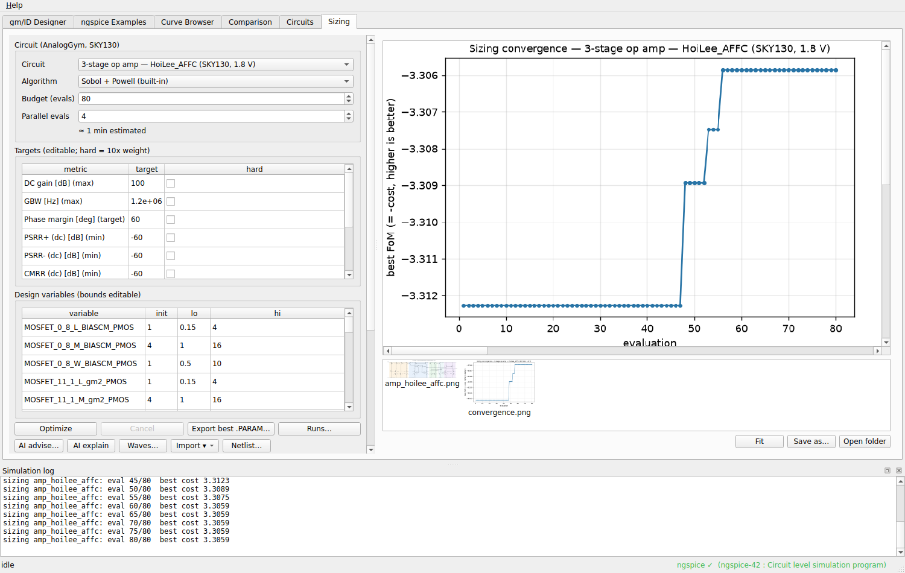

<p align="center">
  
</p>

<h1 align="center">Analog Studio</h1>

<p align="center">
  <a href="https://github.com/alexyudragonsword-collab/analog_skill/stargazers"></a>
  <a href="https://github.com/alexyudragonsword-collab/analog_skill/commits/main"></a>
  <a href="https://github.com/alexyudragonsword-collab/analog_skill/actions/workflows/test.yml"></a>
</p>

<p align="center">
  
  
  
  
</p>

**跑在真实 SPICE 之上的模拟 IC 设计桌面工作台。** 从 gm/ID 目标反解器件尺寸、
在 40 个 PTM 模型上浏览器件特性、运行块级电路，并让优化器在 27 个 SKY130
拓扑的电路库上按你自己的指标目标自动搜索尺寸 —— 全部由本机的 ngspice 驱动，
不上云、不需要 PDK 授权。

<p align="center">
  
</p>

本仓库同时归档了这个应用赖以生长的三个 Claude **skill**（`ngspice`、
`gmoverid`、`transistor-models`）—— 如果你是为它们而来，直接看下面的
[Claude skills](#claude-skills)。

---

## 能做什么

| 标签页 | 功能 |
|---|---|
| **gm/ID Designer** | 40 个可选模型 —— 20 个 PTM 体硅（180/130/90/65nm 与 45/32/22nm 的 HP/LP，n+p）+ 20 个 PTM-MG **FinFET**（7/10/14/16/20nm 的 HP/LSTP，经 ngspice 的 OSDI 接口加载 BSIM-CMG，以 **NFIN** 为尺寸变量）。构建 `GmIdTable` 查找表（首次跑仿真并缓存，之后秒开），然后按 gm/ID、按 fT 目标或按 gm·ro 目标定尺寸。工程单位结果表 + 标出工作点的 2×2 设计图。 |
| **ngspice Examples** | 9 个教学案例（DC / AC / Tran / Noise）一键运行，VDD、扫描范围、频率、时序、温度等归入可折叠的 *Advanced* 分组。 |
| **Curve Browser** | 按模型 / L / W 生成并翻阅特性图：IV 特性、gm/ID 四象限、栅电容。会话内缓存。 |
| **Comparison** | 同一模型多沟长对比（L = 180/360/1000nm）、跨节点对比、跨节点栅电容对比。 |
| **Circuits** | 五个块级电路 —— StrongArm 比较器、LDO、自举开关、五管 OTA、两级 Miller 运放 —— 各自带按 DUT 网表绘制的原理图、可编辑参数与可复制的指标报告。 |
| **Sizing** | 在 **27 个电路**上做自动尺寸优化：vendored [AnalogGym](https://github.com/CODA-Team/AnalogGym) 子集的 20 个 SKY130 设计（15 个文献级三级 Miller 运放 + Basic LDO + 4 个 LDO 变体）、1 个自建电流镜 OTA、6 个 PTM circuit-skills 条目。变量边界与指标目标均可编辑，支持**硬约束**；四种优化器（内置 Sobol+Powell、差分进化、Optuna TPE、**LLM 引导**闭环）；并行评估；收敛曲线、前后波形叠加对比、逐器件变更总结、运行历史，以及导入**你自己的 SKY130 运放**。 |

所有仿真任务经单一后台线程串行执行，避免 ngspice scratch 文件冲突；skill 代码
自身的 `print` 进度实时转发到底部日志面板。菜单 Help ▸ Manual（F1）打开中英
双语图文手册。

## 安装

### 预编译包（无需 Python）

每次 push 都会由 [`build-windows.yml`](.github/workflows/build-windows.yml)
构建 Windows 与 Linux 包 —— PyInstaller 与 Nuitka 两条路线，外加一个 Windows
单文件 `.exe`。从绿色运行的 **Actions** 页下载，或在打了 tag 之后从
**Releases** 下载。

**ngspice 不随包分发。** Windows 用户从
[ngspice.sourceforge.io](https://ngspice.sourceforge.io) 下载 zip，把
`Spice64/` 解压到可执行文件同级目录（或在设置里指定路径）。Linux/macOS 用包
管理器安装即可。

### 从源码运行

```bash
git clone https://github.com/alexyudragonsword-collab/analog_skill
cd analog_skill
pip install -r requirements.txt
sudo apt install ngspice        # 或：brew install ngspice
python -m app.main
```

需要 Python 3.11 与 ngspice（建议 42 或更新；FinFET 模型需要 OSDI 支持，即
ngspice ≥ 38）。架构、打包与 ngspice 检测顺序见
[`APP_README.md`](./APP_README.md)；要参与开发见
[`CONTRIBUTING.md`](./CONTRIBUTING.md)。

## 仓库里有什么

| 路径 | |
|---|---|
| `app/` | 应用本体。此处全部为本项目自研代码（MIT）。 |
| `tools/` | 原理图生成器 —— 电路图由网表渲染而来，不是截图。 |
| `studio_circuits/` | 为 Sizing 标签页自建的电路（MIT）。 |
| `ngspice/`、`gmoverid/`、`transistor-models/` | 三个 Claude skill，**原样归档**。 |
| `circuit-skills/` | vendored [analog-circuit-skills](https://github.com/Arcadia-1/analog-circuit-skills) —— 五个块级电路。 |
| `analoggym/` | vendored [AnalogGym](https://github.com/CODA-Team/AnalogGym)（ICCAD'24，BSD-3）开源子集，Sizing 标签页的电路来源。 |

vendored 各树是上游快照，**从不修改** —— 应用按原样从磁盘读取它们。

### 文档索引

| | |
|---|---|
| [`APP_README.md`](./APP_README.md) | 应用架构、源码运行、打包（5 种构建）、代码结构 |
| [`CONTRIBUTING.md`](./CONTRIBUTING.md) | 测试、lint、重新生成原理图、CI、发版 |
| [`ROADMAP.md`](./ROADMAP.md) | 有哪些待办、卡在谁那里、哪些是已决定不做的 |
| [`CHANGELOG.md`](./CHANGELOG.md) | 每个版本改了什么、为什么 |
| [`CODE_PROTECTION.md`](./CODE_PROTECTION.md) | Nuitka 构建保护了什么、没保护什么 |
| 应用内手册（F1） | 面向使用者的中英双语指南 |
| [`ANALOG_REPOS_ANALYSIS.md`](./ANALOG_REPOS_ANALYSIS.md)、[`CIRCUIT_SKILLS_ANALYSIS.md`](./CIRCUIT_SKILLS_ANALYSIS.md)、[`ANALYSIS_REPORT.md`](./ANALYSIS_REPORT.md) | 对上游项目的分析报告，标注了分析日期，作为历史记录保留 |

---

## Claude skills

三个让 Agent 具备模拟电路设计与仿真能力的 skill 包。它们在此原样归档；应用建立
在它们之上，但它们本身仍可独立使用。

| Skill | 定位 | 内容 |
|---|---|---|
| **ngspice** | 入门 | 9 个标准仿真案例（DC / AC / Tran / Noise） |
| **gmoverid** | 进阶设计 | gm/ID 表征 + 设计 API，自动查 W、Id、Vgs、fT、gm·ro |
| **transistor-models** | 模型库 | 完整 PTM 模型集：体硅 180–65nm、HP/LP 45–22nm、FinFET 20–7nm |

<details>
<summary><b>把 skill 装进 Claude Code</b></summary>

全局安装（所有项目可用）：

```bash
git clone --depth 1 https://github.com/alexyudragonsword-collab/analog_skill /tmp/analog_skill \
  && cp -r /tmp/analog_skill/{ngspice,gmoverid,transistor-models} ~/.claude/skills/ \
  && rm -rf /tmp/analog_skill
```

只装到当前项目，把 `~/.claude/skills/` 换成 `.claude/skills/` 即可。之后在
Claude Code 里执行 `/skills`，应能看到这三个名字。每个 skill 的完整说明在它自己
的 `SKILL.md`；可运行脚本与模型文件在各自的 `assets/` 下。

</details>

<details>
<summary><b>Skill 1 — ngspice：九个教学案例</b></summary>

| # | 类型 | 说明 |
|---|---|---|
| 1 | Tran | RC 充电电压与电流 |
| 2 | DC | NMOS Id-Vds 族曲线 |
| 3 | AC | RC 低通滤波器频响 |
| 4 | Noise | RC 滤波器输出噪声谱密度 |
| 5 | Tran | 采样保持开关对比 |
| 6 | Tran | kT/C 噪声时域统计 |
| 7 | DC | NMOS 电流镜输出特性 |
| 8 | AC | 共源放大器 Bode 图 |
| 9 | DC | 传输门导通电阻 |


</details>

<details>
<summary><b>Skill 2 — gmoverid：表征与设计 API</b></summary>

每个工艺节点生成三组标准图：IV 特性 2×2、gm/ID 四象限 2×2、栅电容 vs Vgs。


四个象限分别是：gm/ID vs Vov（画出 BJT 极限 q/kT = 38.6 V⁻¹ 与 2/Vov 渐近线
参考）、Id/W vs gm/ID（跨约 3 个数量级）、fT vs gm/ID（PTM 180nm 峰值约
50GHz，22nm HP 超过 600GHz）、gm·ro vs gm/ID（180nm 弱反型下约 40–42，22nm HP
因短沟道效应仅 2–4）。

```python
from design_gmoverid import GmIdTable, print_op

tbl = GmIdTable('nmos180', W=10.0, L=0.18, vds=0.9)
op = tbl.size(gmid=15.0, Id=100e-6)   # 固定 gm/ID 与 Id，解 W
op = tbl.size_from_ft(5e9, W=20.0)    # fT ≥ 5GHz，取功耗最低的工作点
print_op(op)
```

首次调用自动跑 ngspice 并缓存，之后直接读缓存。skill 自带三个模型
（180 / 45 / 22nm）；需要更多节点请安装 `transistor-models`。

</details>

<details>
<summary><b>Skill 3 — transistor-models：PTM 模型库</b></summary>

PTM（Predictive Technology Model）是亚利桑那州立大学维护的公开 SPICE 模型集，
用于无 PDK 场景下的工艺探索与教学研究。本 skill 打包了
[mec.umn.edu/ptm](https://mec.umn.edu/ptm) 的全部模型：

- 传统体硅：180 / 130 / 90 / 65nm
- 体硅 HP/LP：45 / 32 / 22nm
- PTM-MG FinFET：20 / 16 / 14 / 10 / 7nm，HP + LSTP

按需把 `.lib` 复制到你项目的 `models/`：

```bash
cp transistor-models/assets/models/bulk_cmos/ptm32lp.lib <项目目录>/models/
cp transistor-models/assets/models/finfet/nmos7mg_hp.lib <项目目录>/models/
```

命名规则：`bulk_cmos/ptm{node}{hp|lp}.lib` 与 `bulk_cmos/ptm{node}.lib` 含
NMOS + PMOS（模型名 `nmos`/`pmos`）；`finfet/{n|p}mos{node}mg_{hp|lstp}.lib`
模型名为 `nfet`/`pfet`。详细参数表见
[`transistor-models/references/model_params.md`](./transistor-models/references/model_params.md)。

</details>

## 许可与引用

应用本体、`tools/` 与 `studio_circuits/` 采用 MIT 许可（见
[`LICENSE`](./LICENSE)）。vendored 各树保留各自的许可条款 —— AnalogGym 为
BSD-3（[`analoggym/LICENSE`](./analoggym/LICENSE)）。

PTM 模型文件版权归 ASU PTM 项目所有，可免费用于学术研究。使用时请引用：

- 体硅 CMOS 节点：
  > W. Zhao and Y. Cao, "New Generation of Predictive Technology Model for Sub-45 nm Early Design Exploration," *IEEE Transactions on Electron Devices*, vol. 53, no. 11, pp. 2816-2823, Nov. 2006. doi: [10.1109/TED.2006.884077](https://doi.org/10.1109/TED.2006.884077)

- PTM-MG FinFET 节点：
  > S. Sinha, G. Yeric, V. Chandra, B. Cline and Y. Cao, "Exploring sub-20nm FinFET design with Predictive Technology Models," *DAC 2012*, pp. 283-288. doi: [10.1145/2228360.2228414](https://doi.org/10.1145/2228360.2228414)

<p align="center">
  <a href="./README.md"></a>
</p>
