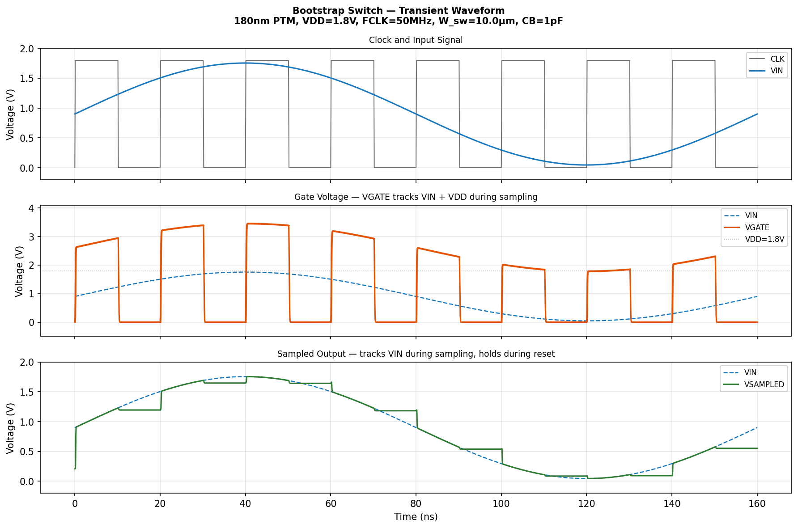

# analog-circuit-skills


`analog-circuit-skills` is a collection of analog circuit simulation skills for AI agents and engineers. The modules are built around **ngspice + Python** and use bundled PTM device models.

Each module is intended to cover the full loop from circuit topology and design intent to netlist generation, simulation, metric extraction, and plotted results.

## Skill Overview

| Skill | Process Node | Supply | Topic |
|------|--------------|--------|-------|
| [comparator](comparator/) | 45nm PTM HP | 1.0 V | StrongArm dynamic comparator |
| [bootstrap_switch](bootstrap_switch/) | 180 / 45 / 22nm PTM | 1.8 / 1.0 / 0.8 V | Bootstrapped sampling switch |
| [LDO](LDO/) | 180nm PTM | 1.8 V | Low-dropout linear regulator |
| [five_transistor_ota](five_transistor_ota/) | 180nm PTM | 1.8 V | Five-transistor CMOS OTA |
| [two_stage_opamp](two_stage_opamp/) | 180nm PTM | 1.8 V | Miller-compensated two-stage op amp |

## Bootstrapped Sampling Switch

`bootstrap_switch` models a bootstrapped NMOS sampling switch for high-linearity ADC front ends.

The bootstrap network raises the sampling transistor gate toward `VIN + VDD`, keeping the sampling-stage `Vgs` approximately constant at `VDD`. This reduces input-dependent on-resistance variation and improves sampling linearity.

**Waveform:** during the sampling phase, `VGATE` tracks `VIN + VDD`.



Key features:

- **Bootstrap action:** the bootstrapping capacitor lifts the sampling transistor gate above the input voltage
- **Nearly constant on-resistance:** `Vgs = VDD` is approximately maintained during sampling
- **Multi-node support:** examples for 180nm, 45nm, and 22nm PTM models
- **Simulation coverage:** transient waveforms, gate boosting behavior, and on-resistance comparison

## StrongArm Dynamic Comparator

`comparator` targets the StrongArm dynamic regenerative comparator commonly used in high-speed SAR ADCs.

The module simulates and analyzes integration, latch regeneration, output decision timing, and input-referred noise. It is useful for studying the tradeoff between speed, power, and noise.


Key features:

- **Transient simulation:** observes internal nodes such as `VXP/VXN`, `VLP/VLN`, and digital outputs
- **Noise extraction:** estimates input-referred noise from transient-noise statistics
- **Ramp response:** checks decision behavior under slowly varying differential input
- **Parameter sweeps:** supports input amplitude, common-mode voltage, tail-device width, and latch-device width sweeps

## Low-Dropout Linear Regulator

`LDO` provides a simulation flow for low-dropout linear regulator design.

The module includes an error amplifier, pass device, feedback network, output capacitor, and compensation network. It can be used to inspect DC regulation, loop stability, load transient behavior, output noise, and power-supply rejection.

Key features:

- **DC simulation:** output voltage, line regulation, and load regulation
- **AC simulation:** loop gain, phase margin, unity-gain bandwidth, and output impedance
- **PSRR analysis:** power-supply rejection across frequency
- **Transient simulation:** load-step and input-step response
- **Noise simulation:** output-noise spectral density and integrated RMS noise
- **Compensation sweeps:** sweeps for `Ccomp`, `Rcomp`, and `Cout`

## Five-Transistor CMOS OTA

`five_transistor_ota` implements a classic single-ended five-transistor CMOS OTA.

The topology consists of an NMOS differential input pair, a PMOS current-mirror active load, and an NMOS tail current source. It is a compact baseline for learning differential gain, small-signal behavior, output swing, and noise analysis.

Key features:

- **DC transfer curve:** sweeps differential input and reports output bias and local gain
- **AC open-loop response:** extracts low-frequency gain, unity-gain bandwidth, and phase
- **Noise simulation:** reports output-noise spectral density and integrated RMS noise
- **Editable sizing parameters:** input pair, load devices, tail source, and load capacitor are exposed in Python

## Miller-Compensated Two-Stage Op Amp

`two_stage_opamp` implements a PMOS-input Miller-compensated two-stage CMOS operational amplifier.

The topology contains a PMOS differential input pair, NMOS current-mirror load, NMOS common-source second gain stage, PMOS current-source load, bias mirror, and Miller compensation capacitor `Cc`. The module is designed to inspect gain, dominant pole, non-dominant pole, zeros, phase margin, and noise reporting conventions.

Key features:

- **DC operating point:** output bias, first-stage output node, bias node, supply current, and power
- **Gain/phase sweep:** open-loop gain and phase versus frequency
- **Pole-zero analysis:** uses ngspice PZ analysis to extract dominant poles, non-dominant poles, and zeros
- **Noise simulation:** reports open-loop output noise, input-referred noise, and unity-gain closed-loop output noise
- **Stability checks:** reports non-dominant pole and first right-half-plane zero ratios relative to unity-gain bandwidth

## How To Run

Make sure `ngspice` is installed and available on `PATH`, and that the Python environment has `numpy`, `matplotlib`, and `scipy`.

```bash
# Bootstrapped sampling switch
cd bootstrap_switch/assets
python run_tran_bts.py

# StrongArm dynamic comparator
cd comparator/assets
python run_tran_strongarm_comp.py

# Low-dropout regulator
python LDO/scripts/run_ldo.py

# Five-transistor CMOS OTA
python five_transistor_ota/scripts/run_ota.py

# Miller-compensated two-stage op amp
python two_stage_opamp/scripts/run_opamp.py
```

Each module writes logs, rendered netlists, raw text data, and plots. The comparator and bootstrapped switch use their own `.work_*` output directories. The LDO, five-transistor OTA, and two-stage op amp use the repository-level `WORK/` directory by default.

## Requirements

- [ngspice](https://ngspice.sourceforge.io/): open-source SPICE simulator, available on `PATH`
- Python 3
- Python packages: `numpy`, `matplotlib`, `scipy`
- PTM model files bundled inside the corresponding modules

## Repository Structure

```text
analog-circuit-skills/
├── comparator/              # StrongArm dynamic comparator skill
│   ├── SKILL.md             # Detailed documentation
│   └── assets/              # Netlist templates and Python scripts
├── bootstrap_switch/        # Bootstrapped sampling switch skill
│   ├── SKILL.md             # Detailed documentation
│   └── assets/              # Netlist templates and Python scripts
├── LDO/                     # Low-dropout regulator skill
│   ├── SKILL.md             # Detailed documentation
│   ├── assets/              # PTM models and netlist templates
│   └── scripts/             # DC, AC, noise, transient, and sweep scripts
├── five_transistor_ota/     # Five-transistor CMOS OTA skill
│   ├── SKILL.md             # Detailed documentation
│   ├── assets/              # PTM models and netlist templates
│   └── scripts/             # DC, AC, and noise simulation scripts
├── two_stage_opamp/         # Miller-compensated two-stage op amp skill
│   ├── SKILL.md             # Detailed documentation
│   ├── assets/              # PTM models and netlist templates
│   └── scripts/             # DC, AC, pole-zero, and noise simulation scripts
├── .work_comparator/        # Comparator temporary output directory
├── .work_bootstrap/         # Bootstrapped switch temporary output directory
├── WORK/                    # LDO, OTA, and op amp output directory
└── README.md                # This file
```

## Simulation Outputs

Common outputs include:

- `logs/`: ngspice logs, metric reports, and raw text data
- `plots/`: waveforms, Bode plots, noise curves, and operating-point figures
- `netlists/`: rendered device-under-test netlists and testbench netlists

Generated output directories are ignored by `.gitignore` and are not intended to be committed.

## Detailed Skill Documentation

For circuit theory, topology notes, parameter explanations, simulation methods, and metric interpretation, see the `SKILL.md` file inside each module directory.
